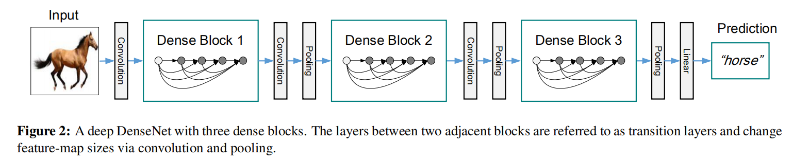
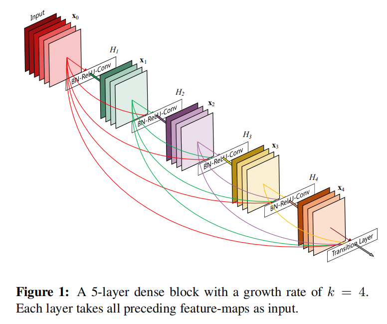
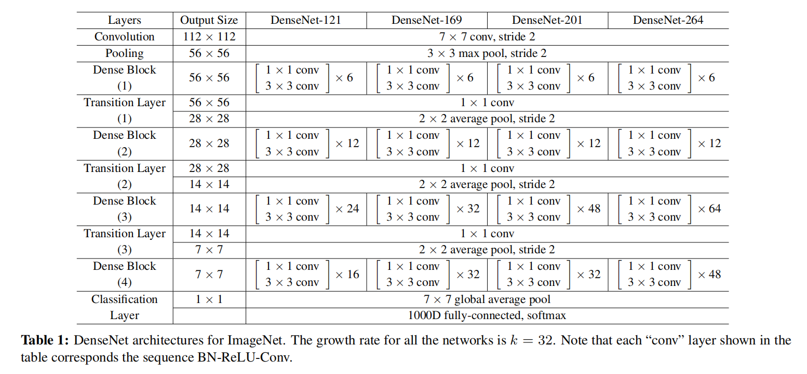
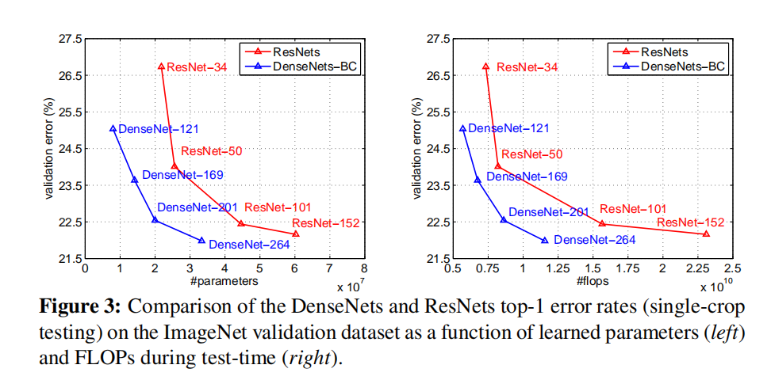

# DenseNet

参考：[学习 Densely Connected Convolutional Networks](https://blog.zhujian.life/posts/4129fe4c.html)

`DenseNet`通过密集连接设计，将每一层输出作为后续所有层的输入，通过加强特征传播，能够减轻梯度消失的问题；同时通过鼓励特征重用，大大减少了参数数量



`DenseNet`主要由两个模块组成：

1. `Dense Block`（负责特征提取）
2. `Trantition Layer`（负责特征图衰减）

其中`Dense Block`中使用$3\times 3$卷积进行特征提取，同时利用$1\times 1$卷积来控制输入特征图个数，所以组成一个`Dense Layer`模块（`Conv(1x1) + Conv(3x3)`）进行实现

## Dense Layer

* 实现文件：`py/lib/models/densenet/dense_layer.py`

其实现流程如下：

```
BN -> ReLU -> Conv(1x1) -> BN -> ReLU -> Conv(3x3)
```

##  Dense Block



* 实现文件：`py/lib/models/densenet/dense_block.py`

在每个`Dense Block`中，由多个`Dense Layer`组成，同时其每个`Dense Layer`的输出都作为后续`Dense Layer`的输入。不同的输入数据通过连接（`concatenating`）方式合并

## Trantition Layer

* 实现文件：`py/lib/models/densenet/transition.py`

通过`Trantition Layer`模块进行特征图减半操作，每个`Tranisition`由一个`Conv(1x1)`和一个$2\times 2$大小的平均池化组成，其实现流程如下：

```
BN -> ReLU -> Conv(1x1) -> AvgPool(2x2)
```

## DenseNet

参考：[pytorch densenet.py](https://github.com/pytorch/vision/blob/master/torchvision/models/densenet.py)

* 实现文件：`py/lib/models/densenet/denset_net.py`



## 训练



比较`DenseNet-121`和`ResNet-34_v2`