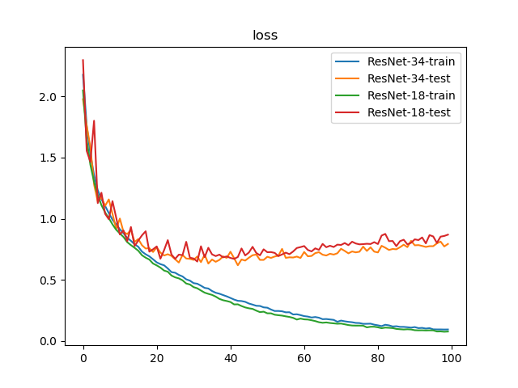
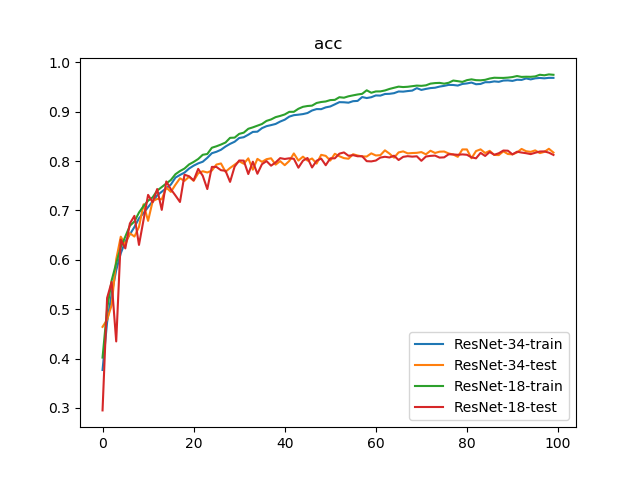

# ResNet-18 vs. ResNet-34

## 训练参数

1. 数据集：`PASCAL VOC 07+12`，`20`类共`40058`个训练样本和`12032`个测试样本
2. 批量大小：`128`
3. 优化器：`Adam`，学习率为`1e-3`，权重衰减为`1e-5`
4. 随步长衰减：每隔`4`轮衰减`5%`，学习因子为`0.95`
5. 迭代次数：`100`轮

## 训练日志





```
$ python classifier_resnet_18_34.py 
{'train': <torch.utils.data.dataloader.DataLoader object at 0x7f636ae61490>, 'test': <torch.utils.data.dataloader.DataLoader object at 0x7f6364fe8ad0>}
{'train': 40058, 'test': 12032}
Epoch 0/99
----------
train Loss: 2.1785 Acc: 0.3769
test Loss: 1.9782 Acc: 0.4642
Epoch 1/99
----------
train Loss: 1.7642 Acc: 0.4735
test Loss: 1.7618 Acc: 0.4786
Epoch 2/99
----------
train Loss: 1.5299 Acc: 0.5308
test Loss: 1.5879 Acc: 0.5083
Epoch 3/99
----------
train Loss: 1.3572 Acc: 0.5790
test Loss: 1.2804 Acc: 0.6009
Epoch 4/99
----------
train Loss: 1.2340 Acc: 0.6131
test Loss: 1.1410 Acc: 0.6469
Epoch 5/99
----------
train Loss: 1.1586 Acc: 0.6372
test Loss: 1.1742 Acc: 0.6311
Epoch 6/99
----------
train Loss: 1.1047 Acc: 0.6516
test Loss: 1.1048 Acc: 0.6540
Epoch 7/99
----------
train Loss: 1.0460 Acc: 0.6665
test Loss: 1.1580 Acc: 0.6471
Epoch 8/99
----------
train Loss: 0.9912 Acc: 0.6841
test Loss: 1.0397 Acc: 0.6666
Epoch 9/99
----------
train Loss: 0.9532 Acc: 0.6946
test Loss: 0.9164 Acc: 0.7125
Epoch 10/99
----------
train Loss: 0.9134 Acc: 0.7068
test Loss: 1.0012 Acc: 0.6789
Epoch 11/99
----------
train Loss: 0.8800 Acc: 0.7183
test Loss: 0.8907 Acc: 0.7188
Epoch 12/99
----------
train Loss: 0.8435 Acc: 0.7306
test Loss: 0.8738 Acc: 0.7234
Epoch 13/99
----------
train Loss: 0.8189 Acc: 0.7380
test Loss: 0.9087 Acc: 0.7226
Epoch 14/99
----------
train Loss: 0.7908 Acc: 0.7451
test Loss: 0.8098 Acc: 0.7465
Epoch 15/99
----------
train Loss: 0.7698 Acc: 0.7525
test Loss: 0.8332 Acc: 0.7376
Epoch 16/99
----------
train Loss: 0.7304 Acc: 0.7666
test Loss: 0.7825 Acc: 0.7521
Epoch 17/99
----------
train Loss: 0.7086 Acc: 0.7719
test Loss: 0.7559 Acc: 0.7651
Epoch 18/99
----------
train Loss: 0.6916 Acc: 0.7767
test Loss: 0.7585 Acc: 0.7601
Epoch 19/99
----------
train Loss: 0.6676 Acc: 0.7849
test Loss: 0.7274 Acc: 0.7683
Epoch 20/99
----------
train Loss: 0.6423 Acc: 0.7908
test Loss: 0.7660 Acc: 0.7601
Epoch 21/99
----------
train Loss: 0.6279 Acc: 0.7954
test Loss: 0.7226 Acc: 0.7753
Epoch 22/99
----------
train Loss: 0.6181 Acc: 0.7987
test Loss: 0.6985 Acc: 0.7794
Epoch 23/99
----------
train Loss: 0.5926 Acc: 0.8066
test Loss: 0.7091 Acc: 0.7769
Epoch 24/99
----------
train Loss: 0.5626 Acc: 0.8160
test Loss: 0.6954 Acc: 0.7808
Epoch 25/99
----------
train Loss: 0.5574 Acc: 0.8188
test Loss: 0.6675 Acc: 0.7930
Epoch 26/99
----------
train Loss: 0.5396 Acc: 0.8230
test Loss: 0.6409 Acc: 0.7952
Epoch 27/99
----------
train Loss: 0.5270 Acc: 0.8295
test Loss: 0.7026 Acc: 0.7783
Epoch 28/99
----------
train Loss: 0.5035 Acc: 0.8349
test Loss: 0.6740 Acc: 0.7861
Epoch 29/99
----------
train Loss: 0.4928 Acc: 0.8392
test Loss: 0.6709 Acc: 0.7927
Epoch 30/99
----------
train Loss: 0.4724 Acc: 0.8468
test Loss: 0.6629 Acc: 0.7996
Epoch 31/99
----------
train Loss: 0.4675 Acc: 0.8484
test Loss: 0.6904 Acc: 0.7946
Epoch 32/99
----------
train Loss: 0.4514 Acc: 0.8535
test Loss: 0.6443 Acc: 0.8056
Epoch 33/99
----------
train Loss: 0.4333 Acc: 0.8591
test Loss: 0.7052 Acc: 0.7826
Epoch 34/99
----------
train Loss: 0.4283 Acc: 0.8596
test Loss: 0.6326 Acc: 0.8045
Epoch 35/99
----------
train Loss: 0.4080 Acc: 0.8667
test Loss: 0.6657 Acc: 0.7985
Epoch 36/99
----------
train Loss: 0.3935 Acc: 0.8708
test Loss: 0.6472 Acc: 0.8039
Epoch 37/99
----------
train Loss: 0.3857 Acc: 0.8729
test Loss: 0.6626 Acc: 0.8057
Epoch 38/99
----------
train Loss: 0.3747 Acc: 0.8753
test Loss: 0.6912 Acc: 0.7928
Epoch 39/99
----------
train Loss: 0.3639 Acc: 0.8801
test Loss: 0.6790 Acc: 0.8000
Epoch 40/99
----------
train Loss: 0.3510 Acc: 0.8839
test Loss: 0.7294 Acc: 0.7917
Epoch 41/99
----------
train Loss: 0.3377 Acc: 0.8901
test Loss: 0.6763 Acc: 0.8003
Epoch 42/99
----------
train Loss: 0.3277 Acc: 0.8930
test Loss: 0.6185 Acc: 0.8155
Epoch 43/99
----------
train Loss: 0.3257 Acc: 0.8940
test Loss: 0.6658 Acc: 0.8010
Epoch 44/99
----------
train Loss: 0.3192 Acc: 0.8952
test Loss: 0.6571 Acc: 0.8090
Epoch 45/99
----------
train Loss: 0.3054 Acc: 0.8974
test Loss: 0.6805 Acc: 0.8009
Epoch 46/99
----------
train Loss: 0.2966 Acc: 0.9025
test Loss: 0.7008 Acc: 0.8053
Epoch 47/99
----------
train Loss: 0.2869 Acc: 0.9054
test Loss: 0.7062 Acc: 0.7950
Epoch 48/99
----------
train Loss: 0.2854 Acc: 0.9052
test Loss: 0.6628 Acc: 0.8127
Epoch 49/99
----------
train Loss: 0.2740 Acc: 0.9088
test Loss: 0.6625 Acc: 0.8106
Epoch 50/99
----------
train Loss: 0.2712 Acc: 0.9107
test Loss: 0.6882 Acc: 0.8010
Epoch 51/99
----------
train Loss: 0.2563 Acc: 0.9150
test Loss: 0.6789 Acc: 0.8148
Epoch 52/99
----------
train Loss: 0.2442 Acc: 0.9194
test Loss: 0.6903 Acc: 0.8098
Epoch 53/99
----------
train Loss: 0.2444 Acc: 0.9192
test Loss: 0.6975 Acc: 0.8060
Epoch 54/99
----------
train Loss: 0.2418 Acc: 0.9183
test Loss: 0.7527 Acc: 0.8048
Epoch 55/99
----------
train Loss: 0.2334 Acc: 0.9214
test Loss: 0.6794 Acc: 0.8139
Epoch 56/99
----------
train Loss: 0.2340 Acc: 0.9220
test Loss: 0.6839 Acc: 0.8113
Epoch 57/99
----------
train Loss: 0.2158 Acc: 0.9297
test Loss: 0.6822 Acc: 0.8095
Epoch 58/99
----------
train Loss: 0.2175 Acc: 0.9277
test Loss: 0.6897 Acc: 0.8093
Epoch 59/99
----------
train Loss: 0.2107 Acc: 0.9294
test Loss: 0.6784 Acc: 0.8157
Epoch 60/99
----------
train Loss: 0.2023 Acc: 0.9330
test Loss: 0.7275 Acc: 0.8114
Epoch 61/99
----------
train Loss: 0.1985 Acc: 0.9327
test Loss: 0.6921 Acc: 0.8120
Epoch 62/99
----------
train Loss: 0.1909 Acc: 0.9359
test Loss: 0.6950 Acc: 0.8218
Epoch 63/99
----------
train Loss: 0.1949 Acc: 0.9363
test Loss: 0.7182 Acc: 0.8152
Epoch 64/99
----------
train Loss: 0.1891 Acc: 0.9376
test Loss: 0.7259 Acc: 0.8069
Epoch 65/99
----------
train Loss: 0.1772 Acc: 0.9410
test Loss: 0.7052 Acc: 0.8176
Epoch 66/99
----------
train Loss: 0.1785 Acc: 0.9407
test Loss: 0.6985 Acc: 0.8196
Epoch 67/99
----------
train Loss: 0.1749 Acc: 0.9419
test Loss: 0.7130 Acc: 0.8157
Epoch 68/99
----------
train Loss: 0.1715 Acc: 0.9428
test Loss: 0.7060 Acc: 0.8163
Epoch 69/99
----------
train Loss: 0.1558 Acc: 0.9478
test Loss: 0.7168 Acc: 0.8167
Epoch 70/99
----------
train Loss: 0.1658 Acc: 0.9442
test Loss: 0.7536 Acc: 0.8182
Epoch 71/99
----------
train Loss: 0.1597 Acc: 0.9463
test Loss: 0.7360 Acc: 0.8137
Epoch 72/99
----------
train Loss: 0.1553 Acc: 0.9479
test Loss: 0.7163 Acc: 0.8210
Epoch 73/99
----------
train Loss: 0.1522 Acc: 0.9486
test Loss: 0.7317 Acc: 0.8165
Epoch 74/99
----------
train Loss: 0.1466 Acc: 0.9509
test Loss: 0.7243 Acc: 0.8191
Epoch 75/99
----------
train Loss: 0.1454 Acc: 0.9524
test Loss: 0.7296 Acc: 0.8194
Epoch 76/99
----------
train Loss: 0.1389 Acc: 0.9544
test Loss: 0.7714 Acc: 0.8154
Epoch 77/99
----------
train Loss: 0.1394 Acc: 0.9542
test Loss: 0.7360 Acc: 0.8133
Epoch 78/99
----------
train Loss: 0.1406 Acc: 0.9530
test Loss: 0.7656 Acc: 0.8087
Epoch 79/99
----------
train Loss: 0.1323 Acc: 0.9563
test Loss: 0.7304 Acc: 0.8236
Epoch 80/99
----------
train Loss: 0.1270 Acc: 0.9573
test Loss: 0.7238 Acc: 0.8236
Epoch 81/99
----------
train Loss: 0.1205 Acc: 0.9591
test Loss: 0.7779 Acc: 0.8058
Epoch 82/99
----------
train Loss: 0.1316 Acc: 0.9557
test Loss: 0.7625 Acc: 0.8203
Epoch 83/99
----------
train Loss: 0.1267 Acc: 0.9563
test Loss: 0.7439 Acc: 0.8238
Epoch 84/99
----------
train Loss: 0.1174 Acc: 0.9598
test Loss: 0.7520 Acc: 0.8164
Epoch 85/99
----------
train Loss: 0.1194 Acc: 0.9598
test Loss: 0.7494 Acc: 0.8208
Epoch 86/99
----------
train Loss: 0.1141 Acc: 0.9615
test Loss: 0.7664 Acc: 0.8125
Epoch 87/99
----------
train Loss: 0.1141 Acc: 0.9606
test Loss: 0.7872 Acc: 0.8122
Epoch 88/99
----------
train Loss: 0.1114 Acc: 0.9632
test Loss: 0.7671 Acc: 0.8197
Epoch 89/99
----------
train Loss: 0.1082 Acc: 0.9635
test Loss: 0.8191 Acc: 0.8143
Epoch 90/99
----------
train Loss: 0.1124 Acc: 0.9625
test Loss: 0.7820 Acc: 0.8137
Epoch 91/99
----------
train Loss: 0.1041 Acc: 0.9648
test Loss: 0.7840 Acc: 0.8175
Epoch 92/99
----------
train Loss: 0.1059 Acc: 0.9645
test Loss: 0.7768 Acc: 0.8246
Epoch 93/99
----------
train Loss: 0.1004 Acc: 0.9675
test Loss: 0.7688 Acc: 0.8200
Epoch 94/99
----------
train Loss: 0.1039 Acc: 0.9655
test Loss: 0.7748 Acc: 0.8187
Epoch 95/99
----------
train Loss: 0.0938 Acc: 0.9677
test Loss: 0.7750 Acc: 0.8217
Epoch 96/99
----------
train Loss: 0.0932 Acc: 0.9684
test Loss: 0.7978 Acc: 0.8162
Epoch 97/99
----------
train Loss: 0.0932 Acc: 0.9677
test Loss: 0.8126 Acc: 0.8187
Epoch 98/99
----------
train Loss: 0.0925 Acc: 0.9686
test Loss: 0.7727 Acc: 0.8250
Epoch 99/99
----------
train Loss: 0.0929 Acc: 0.9686
test Loss: 0.7930 Acc: 0.8173
Training complete in 218m 17s
Best test Acc: 0.824967
train ResNet-34 done

Epoch 0/99
----------
train Loss: 2.0505 Acc: 0.4020
test Loss: 2.2982 Acc: 0.2950
Epoch 1/99
----------
train Loss: 1.6476 Acc: 0.5000
test Loss: 1.5559 Acc: 0.5227
Epoch 2/99
----------
train Loss: 1.4420 Acc: 0.5584
test Loss: 1.4650 Acc: 0.5554
Epoch 3/99
----------
train Loss: 1.3024 Acc: 0.5931
test Loss: 1.8020 Acc: 0.4347
Epoch 4/99
----------
train Loss: 1.1946 Acc: 0.6258
test Loss: 1.1273 Acc: 0.6410
Epoch 5/99
----------
train Loss: 1.1111 Acc: 0.6471
test Loss: 1.2125 Acc: 0.6232
Epoch 6/99
----------
train Loss: 1.0510 Acc: 0.6691
test Loss: 1.0401 Acc: 0.6735
Epoch 7/99
----------
train Loss: 1.0045 Acc: 0.6776
test Loss: 0.9957 Acc: 0.6891
Epoch 8/99
----------
train Loss: 0.9536 Acc: 0.6958
test Loss: 1.1435 Acc: 0.6302
Epoch 9/99
----------
train Loss: 0.9095 Acc: 0.7090
test Loss: 1.0093 Acc: 0.6809
Epoch 10/99
----------
train Loss: 0.8793 Acc: 0.7197
test Loss: 0.8707 Acc: 0.7315
Epoch 11/99
----------
train Loss: 0.8498 Acc: 0.7265
test Loss: 0.9032 Acc: 0.7165
Epoch 12/99
----------
train Loss: 0.8079 Acc: 0.7402
test Loss: 0.8160 Acc: 0.7434
Epoch 13/99
----------
train Loss: 0.7835 Acc: 0.7475
test Loss: 0.9321 Acc: 0.7011
Epoch 14/99
----------
train Loss: 0.7614 Acc: 0.7547
test Loss: 0.7760 Acc: 0.7588
Epoch 15/99
----------
train Loss: 0.7378 Acc: 0.7617
test Loss: 0.8211 Acc: 0.7429
Epoch 16/99
----------
train Loss: 0.7007 Acc: 0.7734
test Loss: 0.8638 Acc: 0.7304
Epoch 17/99
----------
train Loss: 0.6807 Acc: 0.7799
test Loss: 0.8970 Acc: 0.7172
Epoch 18/99
----------
train Loss: 0.6652 Acc: 0.7850
test Loss: 0.7300 Acc: 0.7724
Epoch 19/99
----------
train Loss: 0.6329 Acc: 0.7932
test Loss: 0.7494 Acc: 0.7692
Epoch 20/99
----------
train Loss: 0.6176 Acc: 0.7983
test Loss: 0.7729 Acc: 0.7610
Epoch 21/99
----------
train Loss: 0.5993 Acc: 0.8043
test Loss: 0.6724 Acc: 0.7842
Epoch 22/99
----------
train Loss: 0.5752 Acc: 0.8128
test Loss: 0.7426 Acc: 0.7703
Epoch 23/99
----------
train Loss: 0.5659 Acc: 0.8144
test Loss: 0.8244 Acc: 0.7434
Epoch 24/99
----------
train Loss: 0.5346 Acc: 0.8271
test Loss: 0.7065 Acc: 0.7882
Epoch 25/99
----------
train Loss: 0.5197 Acc: 0.8300
test Loss: 0.6712 Acc: 0.7881
Epoch 26/99
----------
train Loss: 0.5113 Acc: 0.8335
test Loss: 0.7057 Acc: 0.7816
Epoch 27/99
----------
train Loss: 0.4953 Acc: 0.8377
test Loss: 0.7015 Acc: 0.7803
Epoch 28/99
----------
train Loss: 0.4693 Acc: 0.8471
test Loss: 0.8107 Acc: 0.7579
Epoch 29/99
----------
train Loss: 0.4611 Acc: 0.8475
test Loss: 0.6808 Acc: 0.7889
Epoch 30/99
----------
train Loss: 0.4397 Acc: 0.8551
test Loss: 0.6741 Acc: 0.8012
Epoch 31/99
----------
train Loss: 0.4300 Acc: 0.8576
test Loss: 0.6491 Acc: 0.8009
Epoch 32/99
----------
train Loss: 0.4118 Acc: 0.8655
test Loss: 0.7742 Acc: 0.7738
Epoch 33/99
----------
train Loss: 0.3944 Acc: 0.8684
test Loss: 0.6846 Acc: 0.7988
Epoch 34/99
----------
train Loss: 0.3845 Acc: 0.8718
test Loss: 0.7618 Acc: 0.7744
Epoch 35/99
----------
train Loss: 0.3761 Acc: 0.8751
test Loss: 0.7080 Acc: 0.7937
Epoch 36/99
----------
train Loss: 0.3619 Acc: 0.8814
test Loss: 0.6938 Acc: 0.8000
Epoch 37/99
----------
train Loss: 0.3434 Acc: 0.8844
test Loss: 0.7057 Acc: 0.7907
Epoch 38/99
----------
train Loss: 0.3324 Acc: 0.8891
test Loss: 0.6835 Acc: 0.7974
Epoch 39/99
----------
train Loss: 0.3258 Acc: 0.8915
test Loss: 0.6911 Acc: 0.8060
Epoch 40/99
----------
train Loss: 0.3178 Acc: 0.8945
test Loss: 0.6787 Acc: 0.8043
Epoch 41/99
----------
train Loss: 0.2981 Acc: 0.8998
test Loss: 0.6709 Acc: 0.8057
Epoch 42/99
----------
train Loss: 0.2989 Acc: 0.8999
test Loss: 0.6863 Acc: 0.8047
Epoch 43/99
----------
train Loss: 0.2849 Acc: 0.9060
test Loss: 0.7562 Acc: 0.7867
Epoch 44/99
----------
train Loss: 0.2735 Acc: 0.9100
test Loss: 0.6990 Acc: 0.8008
Epoch 45/99
----------
train Loss: 0.2663 Acc: 0.9116
test Loss: 0.7230 Acc: 0.8063
Epoch 46/99
----------
train Loss: 0.2614 Acc: 0.9124
test Loss: 0.7698 Acc: 0.7871
Epoch 47/99
----------
train Loss: 0.2473 Acc: 0.9177
test Loss: 0.7196 Acc: 0.8008
Epoch 48/99
----------
train Loss: 0.2351 Acc: 0.9197
test Loss: 0.7000 Acc: 0.8051
Epoch 49/99
----------
train Loss: 0.2386 Acc: 0.9208
test Loss: 0.7492 Acc: 0.7916
Epoch 50/99
----------
train Loss: 0.2253 Acc: 0.9236
test Loss: 0.7257 Acc: 0.8056
Epoch 51/99
----------
train Loss: 0.2252 Acc: 0.9240
test Loss: 0.7265 Acc: 0.8056
Epoch 52/99
----------
train Loss: 0.2136 Acc: 0.9294
test Loss: 0.7199 Acc: 0.8151
Epoch 53/99
----------
train Loss: 0.2097 Acc: 0.9284
test Loss: 0.6937 Acc: 0.8176
Epoch 54/99
----------
train Loss: 0.2064 Acc: 0.9313
test Loss: 0.7073 Acc: 0.8108
Epoch 55/99
----------
train Loss: 0.2005 Acc: 0.9332
test Loss: 0.7220 Acc: 0.8121
Epoch 56/99
----------
train Loss: 0.1955 Acc: 0.9349
test Loss: 0.7094 Acc: 0.8098
Epoch 57/99
----------
train Loss: 0.1879 Acc: 0.9363
test Loss: 0.7313 Acc: 0.8098
Epoch 58/99
----------
train Loss: 0.1742 Acc: 0.9434
test Loss: 0.7600 Acc: 0.7999
Epoch 59/99
----------
train Loss: 0.1820 Acc: 0.9384
test Loss: 0.7674 Acc: 0.7994
Epoch 60/99
----------
train Loss: 0.1757 Acc: 0.9411
test Loss: 0.7760 Acc: 0.8011
Epoch 61/99
----------
train Loss: 0.1743 Acc: 0.9412
test Loss: 0.7438 Acc: 0.8072
Epoch 62/99
----------
train Loss: 0.1685 Acc: 0.9431
test Loss: 0.7321 Acc: 0.8088
Epoch 63/99
----------
train Loss: 0.1616 Acc: 0.9462
test Loss: 0.7571 Acc: 0.8073
Epoch 64/99
----------
train Loss: 0.1524 Acc: 0.9485
test Loss: 0.7446 Acc: 0.8109
Epoch 65/99
----------
train Loss: 0.1477 Acc: 0.9508
test Loss: 0.7935 Acc: 0.8022
Epoch 66/99
----------
train Loss: 0.1505 Acc: 0.9500
test Loss: 0.7664 Acc: 0.8086
Epoch 67/99
----------
train Loss: 0.1459 Acc: 0.9506
test Loss: 0.7785 Acc: 0.8100
Epoch 68/99
----------
train Loss: 0.1431 Acc: 0.9518
test Loss: 0.7680 Acc: 0.8090
Epoch 69/99
----------
train Loss: 0.1399 Acc: 0.9529
test Loss: 0.7876 Acc: 0.8098
Epoch 70/99
----------
train Loss: 0.1413 Acc: 0.9524
test Loss: 0.7851 Acc: 0.8006
Epoch 71/99
----------
train Loss: 0.1354 Acc: 0.9535
test Loss: 0.8004 Acc: 0.8093
Epoch 72/99
----------
train Loss: 0.1291 Acc: 0.9569
test Loss: 0.7835 Acc: 0.8106
Epoch 73/99
----------
train Loss: 0.1254 Acc: 0.9580
test Loss: 0.8115 Acc: 0.8112
Epoch 74/99
----------
train Loss: 0.1246 Acc: 0.9585
test Loss: 0.7969 Acc: 0.8071
Epoch 75/99
----------
train Loss: 0.1247 Acc: 0.9569
test Loss: 0.7898 Acc: 0.8076
Epoch 76/99
----------
train Loss: 0.1239 Acc: 0.9587
test Loss: 0.7917 Acc: 0.8138
Epoch 77/99
----------
train Loss: 0.1103 Acc: 0.9632
test Loss: 0.7947 Acc: 0.8135
Epoch 78/99
----------
train Loss: 0.1152 Acc: 0.9619
test Loss: 0.7926 Acc: 0.8127
Epoch 79/99
----------
train Loss: 0.1155 Acc: 0.9604
test Loss: 0.8077 Acc: 0.8136
Epoch 80/99
----------
train Loss: 0.1106 Acc: 0.9640
test Loss: 0.7925 Acc: 0.8128
Epoch 81/99
----------
train Loss: 0.1033 Acc: 0.9656
test Loss: 0.8618 Acc: 0.8077
Epoch 82/99
----------
train Loss: 0.1082 Acc: 0.9640
test Loss: 0.8754 Acc: 0.8056
Epoch 83/99
----------
train Loss: 0.1066 Acc: 0.9637
test Loss: 0.8161 Acc: 0.8167
Epoch 84/99
----------
train Loss: 0.1045 Acc: 0.9647
test Loss: 0.8175 Acc: 0.8104
Epoch 85/99
----------
train Loss: 0.0976 Acc: 0.9673
test Loss: 0.7753 Acc: 0.8184
Epoch 86/99
----------
train Loss: 0.0949 Acc: 0.9689
test Loss: 0.8162 Acc: 0.8128
Epoch 87/99
----------
train Loss: 0.0928 Acc: 0.9686
test Loss: 0.8276 Acc: 0.8159
Epoch 88/99
----------
train Loss: 0.0947 Acc: 0.9685
test Loss: 0.7899 Acc: 0.8214
Epoch 89/99
----------
train Loss: 0.0929 Acc: 0.9691
test Loss: 0.8025 Acc: 0.8211
Epoch 90/99
----------
train Loss: 0.0868 Acc: 0.9702
test Loss: 0.8309 Acc: 0.8136
Epoch 91/99
----------
train Loss: 0.0857 Acc: 0.9723
test Loss: 0.8248 Acc: 0.8190
Epoch 92/99
----------
train Loss: 0.0862 Acc: 0.9705
test Loss: 0.8465 Acc: 0.8173
Epoch 93/99
----------
train Loss: 0.0848 Acc: 0.9709
test Loss: 0.7981 Acc: 0.8160
Epoch 94/99
----------
train Loss: 0.0858 Acc: 0.9707
test Loss: 0.8655 Acc: 0.8142
Epoch 95/99
----------
train Loss: 0.0854 Acc: 0.9716
test Loss: 0.8546 Acc: 0.8169
Epoch 96/99
----------
train Loss: 0.0764 Acc: 0.9749
test Loss: 0.8018 Acc: 0.8194
Epoch 97/99
----------
train Loss: 0.0771 Acc: 0.9738
test Loss: 0.8530 Acc: 0.8196
Epoch 98/99
----------
train Loss: 0.0743 Acc: 0.9756
test Loss: 0.8586 Acc: 0.8171
Epoch 99/99
----------
train Loss: 0.0761 Acc: 0.9748
test Loss: 0.8692 Acc: 0.8125
Training complete in 171m 16s
Best test Acc: 0.821393
train ResNet-18 done
```