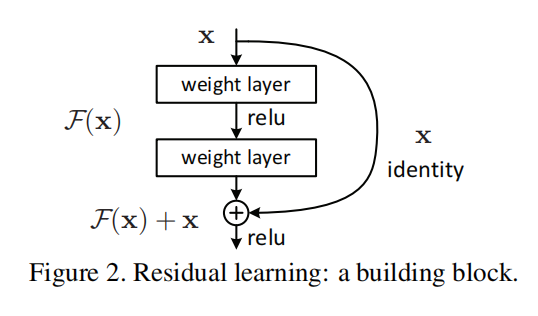
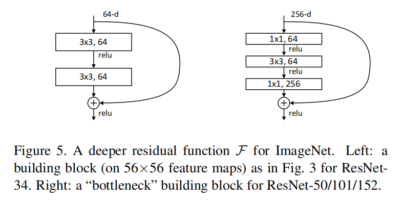
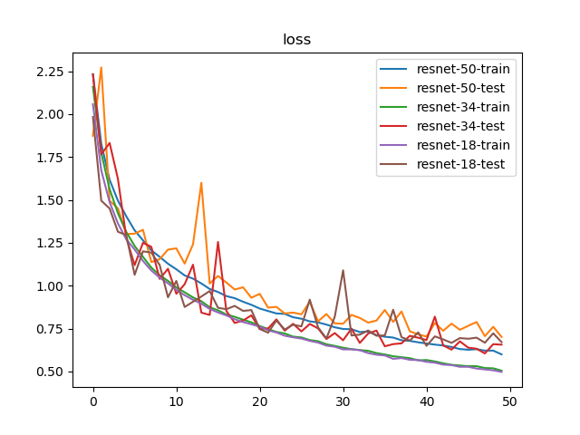
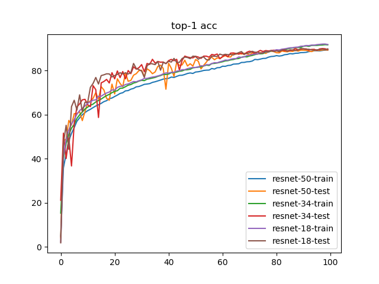
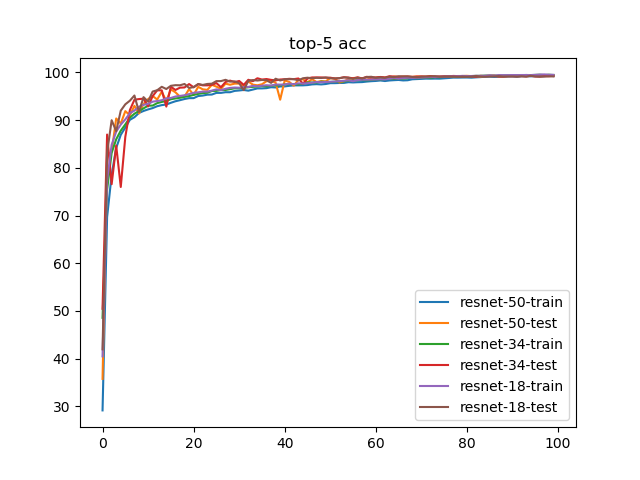

# ResNet

`ResNet`通过残差结构的实现，缓解了网络退化的现象，能够用更深的模型（超过`100`层）得到更好的训练结果

##  BasicBlock实现

* 实现文件：`py/lib/models/resnet/basic_block.py`



`ResNet-18/34`使用了`BasicBolck`模块，其实现流程如下：

```
x -> Conv(3x3) -> BN -> ReLU -> Conv(3x3) -> BN -> (+x) -> ReLU
```

## Bottleneck实现

* 实现文件：`py/lib/models/resnet/bottleneck.py`



`ResNet-50/101/152`使用`Bottleneck`模块，通过$1\times 1$卷积来减少特征图个数，其实现流程如下：

```
x -> Conv(1x1) -> BN -> ReLU -> Conv(3x3) -> BN -> ReLU -> Conv(1x1) -> BN -> (+x) -> ReLU
```

## ResNet实现

* 实现文件：`py/lib/models/resnet/resnet.py`

## 训练

比较`ResNet-18、ResNet-34、ResNet-50`

* 数据集：`voc 07+12`
* 迭代次数：`100`
* 批量大小：
    * `96（train）`
    * `48（test）`
* 图像预处理：
    * 训练：缩放+随机裁剪+随机水平翻转+颜色抖动+随机擦除+数据标准化
    * 测试：缩放+`Ten Crop`+数据标准化 

* 损失函数：标签平滑正则化，平滑因子`0.1`
* 优化器：`Adam`，学习率`1e-3`，权重衰减`1e-4`
* 学习率策略：`warmup`（共`5`轮）+余弦退火（`95`轮）

## 训练结果







训练日志参考[训练日志](./log-resnet_18-vs-34-vs-50.md)

### 检测精度

* `Top-1 Accuracy`
  * `ResNet-50: 89.37%`
  * `ResNet-34: 90.01%`
  * `ResNet-18: 89.98%`
* `Top-5 Accuracy`
  * `ResNet-50: 99.39%`
  * `ResNet-34: 99.29%`
  * `ResNet-18: 99.29%`

### Flops和参数数目

```
resnet-50: 8.223 GFlops - 97.492 MB
resnet-34: 7.348 GFlops - 83.180 MB
resnet-18: 3.641 GFlops - 44.607 MB
```

## 小结

| CNN Architecture | Data Type (bit) | Model Size (MB) | GFlops （1080Ti） | Top-1 Acc(VOC 07+12) | Top-5 Acc(VOC 07+12) |
|:----------------:|:---------------:|:---------------:|:-----------------:|:--------------------:|:--------------------:|
|     ResNet-18    |        32       |      44.607     |       3.641       |        89.98%        |        99.29%        |
|     ResNet-34    |        32       |      83.180     |       7.348       |        90.01%        |        99.29%        |
|     ResNet-50    |        32       |      97.492     |       8.223       |        89.37%        |        99.39%        |

根据训练结果，`ResNet-34`在`Top 1`准确度中最高；`ResNet-50`在`Top 5`准确度中最高，不过三者的差距都很小

所以进一步改进方向：

1. 更大批量训练
2. 更多数据集训练
3. 学习率和权重衰减选择
4. 使用预训练模型