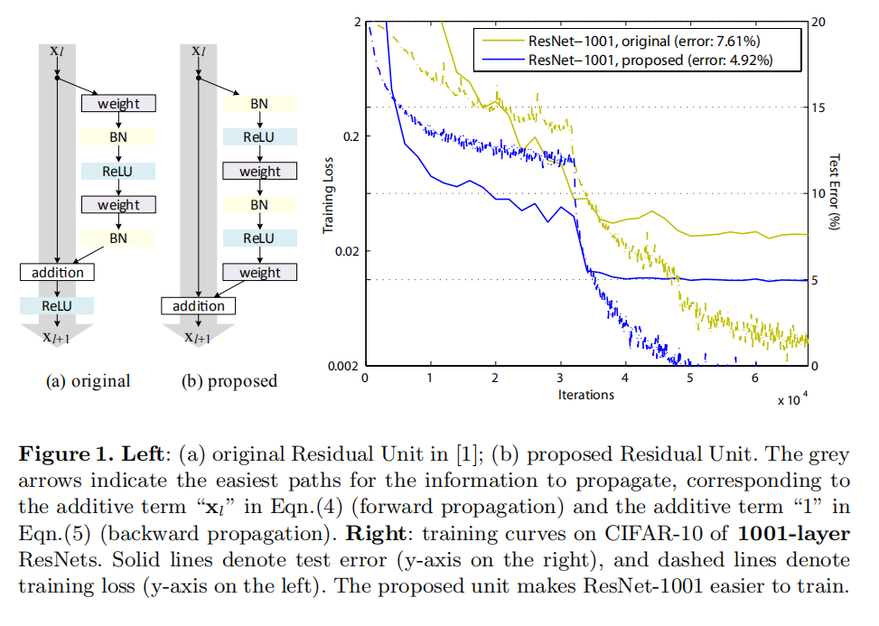
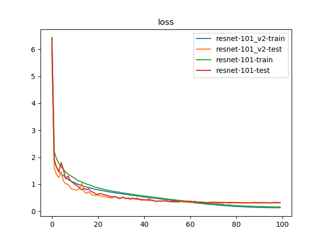
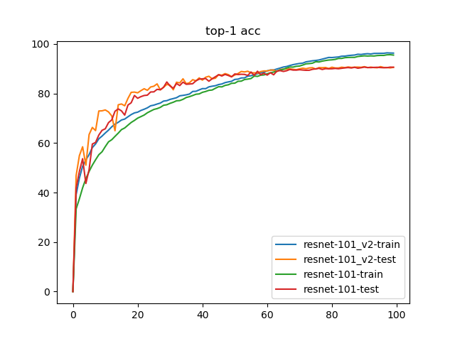
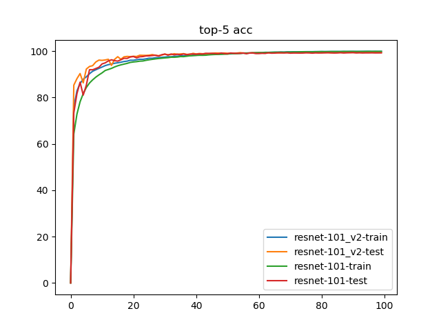

# ResNet_v2

论文[Identity Mappings in Deep Residual Networks](https://arxiv.org/abs/1603.05027)通过推导和实验证明了恒定式映射（`Identity Mapping`）的重要性，同时发现将批量预处理（`BN`）和激活函数（`ReLU`）作用于卷积操作之前（进行**预激活**）能够使得训练更容易

翻译论文地址：[[译]Identity Mappings in Deep Residual Networks](https://blog.zhujian.life/posts/9a5e8e83.html)



##  BasicBlock实现

* 实现文件：`py/lib/models/resnet/basic_block_v2.py`

其实现流程调整如下：

```
# 后激活
x -> Conv(3x3) -> BN -> ReLU -> Conv(3x3) -> BN -> (+x) -> ReLU
# 预激活
x -> BN -> ReLU -> Conv(3x3) -> BN -> ReLU -> Conv(3x3) -> (+x)
```

## Bottleneck实现

* 实现文件：`py/lib/models/resnet/bottleneck_v2.py`

其实现流程调整如下：

```
# 后激活
x -> Conv(1x1) -> BN -> ReLU -> Conv(3x3) -> BN -> ReLU -> Conv(1x1) -> BN -> (+x) -> ReLU
# 预激活
x -> BN -> ReLU -> Conv(1x1) -> BN -> ReLU -> Conv(3x3) -> BN -> ReLU -> Conv(1x1) -> (+x)
```

## ResNet_v2实现

* 实现文件：`py/lib/models/resnet/resnet.py`

## 训练

比较`ResNet-101_v2`和`ResNet-101`

* 数据集：`voc 07+12`
* 迭代次数：`100`
* 批量大小：
    * `96（train）`
    * `48（test）`
* 图像预处理：
    * 训练：缩放+随机裁剪+随机水平翻转+颜色抖动+随机擦除+数据标准化
    * 测试：缩放+`Ten Crop`+数据标准化 

* 损失函数：标签平滑正则化，平滑因子`0.1`
* 优化器：`Adam`，学习率`3e-4`，权重衰减`3e-5`
* 学习率策略：`warmup`（共`5`轮）+余弦退火（`95`轮）

## 训练结果







完整训练日志参考[训练日志](./log-resnet101_v2-vs-resnet101.md)

### 检测精度

* `Top-1 Accuracy`
    * `ResNet-101:  90.66%`
    * `ResNet-101_v2: 90.85%`
* `Top-5 Accuracy`
    * `ResNet-101: 99.35%`
    * `ResNet-101_v2: 99.48%`

### Flops和参数数目

```
resnet-101_v2: 15.668 GFlops - 169.926 MB
resnet-101: 15.668 GFlops - 169.942 MB
```

## 小结

| CNN Architecture | Data Type (bit) | Model Size (MB) | GFlops （1080Ti） | Top-1 Acc(VOC 07+12) | Top-5 Acc(VOC 07+12) |
|:----------------:|:---------------:|:---------------:|:-----------------:|:--------------------:|:--------------------:|
|    ResNet-101    |        32       |    169.942 MB   |       15.668      |        90.66%        |        99.35%        |
|   ResNet-101_v2  |        32       |    169.926 MB   |       15.668      |        90.85%        |        99.48%        |

从训练结果来看，采用预激活的`ResNet`模型能够更快的训练；另外，和之前的`ResNet-18/34/50`的训练结果相比，`ResNet-101`能够得到更高的准确率

进一步训练方向：

1. 更大批量训练
2. 更多数据集训练
3. 使用预训练模型